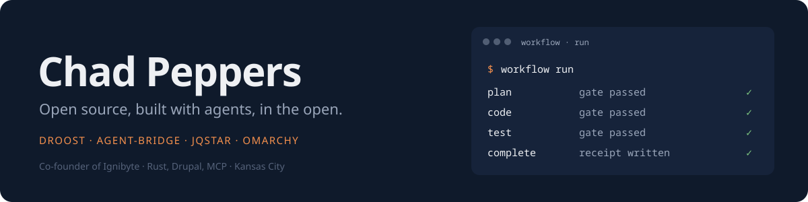
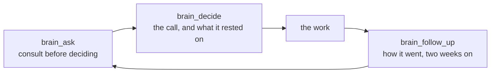
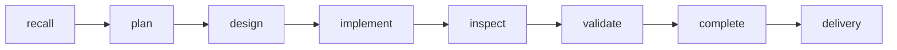

# Hey, I'm Chad

### Open source advocate at Ignibyte. I build with agents, in the open, on Omarchy, and I publish what we build.

---

Two things I care about turned out to be one project: **open source you can actually run**, and **agents that do the work in the open**, with the record of how they did it.

The lab is [Ignibyte](https://ignibyte.com), where the research becomes code, workflows and write-ups anyone can pick up. The desk is [Omarchy](https://omarchy.org), DHH's Arch and Hyprland desktop. The assistant is [Rusty](https://github.com/Ignibyte/rusty), which I built for it.

---

## Droost

Drupal, built by agents. Droost is a developer-acceleration toolkit for AI coding agents working on Drupal: a [drupal.org project](https://www.drupal.org/project/droost), the engine behind it, and the pipeline an agent runs. Live at [droost.org](https://droost.org).

| Repo | What it is |
|---|---|
| **[droost-engine](https://github.com/Ignibyte/droost-engine)** | The framework-free half, plain PHP with no Drupal dependency: the QA verify loop, AI-harness config writers, a guidelines corpus, scaffold generation, wiki composition and code indexing, so the same logic serves the Drupal module, a standalone CLI and repo-only tooling with no site to boot. |
| **[droost-workflow](https://github.com/Ignibyte/droost-workflow)** | The methodology layer: the phased, gated pipeline an agent runs to build or change a Drupal site. Plan, code, test, complete, each phase behind an entry and an exit gate, with what "pass" means configured per repo in one version-controlled file. |
| **[droost.org](https://droost.org)** | The site and the write-ups. |

## agent-bridge

**[ignibyte-bridge](https://github.com/Ignibyte/ignibyte-bridge)** is a local persistent PTY session controller for AI coding agents. A manager program, another agent, a script or you, starts real terminal programs (Claude Code, Codex, REPLs, dev servers, shells), keeps them running, drives them with keystrokes and reads back what is on their screen. What tmux gives a person, exposed to an agent through a small CLI. Validated driving a live Claude Code session; its own adversarial reviews and their resolutions are in the repo.

## jqstar

**[jqstar](https://github.com/Ignibyte/jqstar)** is a full-featured front end for server-rendered applications that do not want to become single-page applications. Routes, validation, permissions and data stay on the server; HTML stays readable before JavaScript runs; reactivity and rich components go where they are needed, updating parts of the page through HTML, JSON or Datastar streams. No JSX, no hydration, no virtual DOM, and your existing templates and jQuery plugins keep working.

## Omarchy

The desktop I run every day, and what I build on it. The plugins install with `omarchy plugin add` and bind to the system theme, so they re-tint with everything else.

| Repo | What it is |
|---|---|
| **[rusty](https://github.com/Ignibyte/rusty)** | A local-first AI assistant for Omarchy: a Rust workspace with a QML desktop app, an MCP back end, an Obsidian-compatible brain, and native Claude Code and Codex terminals. The Claude Code session on my box *is* Rusty; the app is the same store with a face. |
| **[Stay Awake Sessions](https://github.com/Ignibyte/omarchy-stay-awake-sessions)** | Keep the machine awake for a reason that ends by itself: a deadline, a running process, an app with a window open, or any condition you can write as a command. Holds survive shell restarts and reloads. On the Omarchy marketplace. |
| **[Sun Clock](https://github.com/Ignibyte/omarchy-kids-clock)** | A clock for kids, a spoke of [Omarchy Kids](https://github.com/markcuda/omarchy-kids-mode). Where the sun is over the people you love, whether they are awake, and whether it is a good time to call. Three age bands, an analog face, a set-the-clock game, a world map with the night side, a globe of dots. |
| **[Omarchy Gaming System](https://github.com/Ignibyte/omarchy_gaming_system)** | An API-first social gaming system: a Rust server and a keyboard-first QML connector for Omarchy. Connections, private inboxes, challenges and server-authoritative games. |

### How Rusty keeps me honest

Two hooks enforce the loop: the first file write of a session is refused until the brain has been consulted, and a session that wrote files cannot end until it has recorded a decision or said there was none.

| Component | Count | What it is |
|---|---|---|
| **MCP tools** | 85 | Tasks, notes, memories, the brain, skills, secrets, settings, sources |
| **Skills** | 28 | Slash commands that live in Rusty's store and show in the app |
| **Brain pages** | 255 | Projects, concepts, decisions, conversations and ideas, one vault |
| **Decisions recorded** | 11 | Each with its consultation, its alternatives and a follow-up date |
| **Tickets delivered** | 28 | Through a phased pipeline, each with a gate receipt |

`cargo fmt`, `clippy -D warnings`, `cargo test` and `cargo doc`, one at a time, no suppressions; a commit without a matching gate receipt is refused by a hook. Before anything ships, adversarial reviewers go over it. The last round on Sun Clock found twenty wrong time zones, a sunrise equation that made New Zealand night all day on summer time, and a typed place that could hang the clock, all fixed before the first push.

### Rules I paid for

- **Bind to the theme tokens, never a palette.** `Color.*` and `Style.*` from the shell re-tint live; a hex code is right on one of the twenty-two themes and wrong on the rest.
- **Draw with Shapes or plain items, never Canvas.** A Canvas does not re-tint.
- **Hot reload lies.** A change to any local plugin file reloads every plugin, the shell's own idle service included, from the components already compiled: every plugin's state resets and none of your new code runs. `omarchy-restart-shell` is the only reliable load.
- **A `var` property initialised with an array fires its changed handler during construction.** A handler that persists state writes before the object has read what was there.
- **Test on a headless output.** A harness that pops overlays onto the live screen gets clicked away, and a shell restart ends whatever a plugin was holding.
- **Check the data you ship.** Natural Earth's time zone column is wrong for about twenty places. The test suite now checks every zone against tzdata.

---

## Also in the lab

| Repo | What it is |
|---|---|
| **[scorchkit](https://github.com/Ignibyte/scorchkit)** | An agent-neutral application-security testing engine in Rust: deterministic SAST, SCA, secret, artifact, web and API checks behind one engagement policy, with findings and evidence kept for an agent or a person to analyse. Only for systems you own or have permission to test. |
| **[forge](https://github.com/Ignibyte/forge)** | Agentic coding brain. |
| **[oathstar](https://github.com/Ignibyte/oathstar)** | An open source Rust RPG engine, in design: emergent classes, use-based skills, a Datastar and SSE direction. |
| **[monorpgmaker](https://github.com/Ignibyte/monorpgmaker)** | An RPG Maker style game maker on MonoGame: author once in C#, ship to desktop and consoles. |

---

## Toolbelt

**Desktop** · Omarchy · Hyprland · Quickshell / QML · Wayland · Arch
**Languages** · PHP / Drupal · Rust · TypeScript · Python · C# / MonoGame
**Agents** · Claude Code · Codex · MCP · phased pipelines with gate receipts
**Web** · Datastar · jQuery · Drupal 11 · DDEV

---

[chadpeppers.dev](https://chadpeppers.dev) · [ignibyte.com](https://ignibyte.com) · [droost.org](https://droost.org)

*Written on the machine it describes, with Rusty.*

