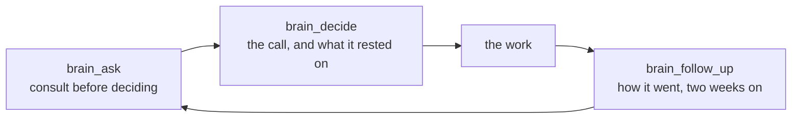
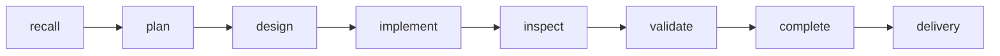

# Hey, I'm Chad

### Open source advocate at Ignibyte. I build on Omarchy, with an assistant that lives on it, and I publish what we build.

---

Two things I care about turned out to be one project: **open source you can actually run**, and **agents that do the work in the open**, with the record of how they did it.

The desk is [Omarchy](https://omarchy.org), DHH's Arch and Hyprland desktop. The assistant is [Rusty](https://github.com/Ignibyte/rusty), a local-first AI assistant I built for it. The lab is [Ignibyte](https://ignibyte.com), where the research becomes code, workflows and write-ups anyone can pick up.

---

## Part One: on the bar

Omarchy plugins, installable with `omarchy plugin add`, bound to the system theme so they re-tint with everything else.

| Plugin | What it does |
|---|---|
| **[Stay Awake Sessions](https://github.com/Ignibyte/omarchy-stay-awake-sessions)** | Keep the machine awake for a reason that ends by itself: a deadline, a running process, an app with a window open, or any condition you can write as a command. Holds survive shell restarts and reloads. On the Omarchy marketplace. |
| **[Sun Clock](https://github.com/Ignibyte/omarchy-kids-clock)** | A clock for kids, a spoke of [Omarchy Kids](https://github.com/markcuda/omarchy-kids-mode). Where the sun is over the people you love, whether they are awake, and whether it is a good time to call. Three age bands, an analog face, a set-the-clock game, a world map with the night side, a globe of dots. |

### Rules I paid for

- **Bind to the theme tokens, never a palette.** `Color.*` and `Style.*` from the shell re-tint live; a hex code is right on one of the twenty-two themes and wrong on the rest.
- **Draw with Shapes or plain items, never Canvas.** A Canvas does not re-tint.
- **Hot reload lies.** A change to any local plugin file reloads every plugin, the shell's own idle service included, from the components already compiled: every plugin's state resets and none of your new code runs. `omarchy-restart-shell` is the only reliable load.
- **A `var` property initialised with an array fires its changed handler during construction.** A handler that persists state writes before the object has read what was there.
- **Test on a headless output.** A harness that pops overlays onto the live screen gets clicked away, and a shell restart ends whatever a plugin was holding.
- **Check the data you ship.** Natural Earth's time zone column is wrong for about twenty places. The test suite now checks every zone against tzdata.

---

## Part Two: the assistant

[Rusty](https://github.com/Ignibyte/rusty) is a local-first AI assistant for Omarchy: a Rust workspace with a QML desktop app, an MCP back end, an Obsidian-compatible brain, and native Claude Code and Codex terminals. The Claude Code session on the box *is* Rusty; the app is the same store with a face.

Two hooks keep that loop honest: the first file write of a session is refused until the brain has been consulted, and a session that wrote files cannot end until it has recorded a decision or said there was none.

| Component | Count | What it is |
|---|---|---|
| **MCP tools** | 85 | Tasks, notes, memories, the brain, skills, secrets, settings, sources |
| **Skills** | 28 | Slash commands that live in Rusty's store and show in the app |
| **Brain pages** | 255 | Projects, concepts, decisions, conversations and ideas, one vault |
| **Decisions recorded** | 11 | Each with its consultation, its alternatives and a follow-up date |
| **Timeline entries** | 286 | What happened, on which page, when |
| **Tickets delivered** | 28 | Through the pipeline below, each with a gate receipt |

### The pipeline

`cargo fmt`, `clippy -D warnings`, `cargo test` and `cargo doc`, one at a time, no suppressions; a commit without a matching gate receipt is refused by a hook. Before anything ships, adversarial reviewers go over it. The last round on Sun Clock found twenty wrong time zones, a sunrise equation that made New Zealand night all day on summer time, and a typed place that could hang the clock, all fixed before the first push.

---

## Part Three: the lab

[Ignibyte](https://ignibyte.com) is an agentic research lab. The outputs are open source code, the method as runnable workflows, and write-ups.

| Repo | What it is |
|---|---|
| **[rusty](https://github.com/Ignibyte/rusty)** | The assistant above. |
| **[droost-engine](https://github.com/Ignibyte/droost-engine)** and **[droost-workflow](https://github.com/Ignibyte/droost-workflow)** | The engine and the phased, gated pipeline an agent runs to build or change a Drupal site. Live at [droost.org](https://droost.org). |
| **[scorchkit](https://github.com/Ignibyte/scorchkit)** | Agentic-first security system. |
| **[forge](https://github.com/Ignibyte/forge)** | Agentic coding brain. |
| **[ignibyte-bridge](https://github.com/Ignibyte/ignibyte-bridge)** | Local persistent PTY session controller for AI coding agents. Like tmux, for agents. |
| **[oathstar](https://github.com/Ignibyte/oathstar)** | Open source Rust RPG engine. |
| **[monorpgmaker](https://github.com/Ignibyte/monorpgmaker)** | An RPG Maker style game maker on MonoGame: author once in C#, ship to desktop and consoles. |
| **[omarchy_gaming_system](https://github.com/Ignibyte/omarchy_gaming_system)** | Omarchy BBS. |
| **[jqstar](https://github.com/Ignibyte/jqstar)** | jQuery plus Datastar. |

---

## Toolbelt

**Desktop** · Omarchy · Hyprland · Quickshell / QML · Wayland · Arch
**Languages** · Rust · PHP / Drupal · TypeScript · Python · C# / MonoGame
**Agents** · Claude Code · Codex · MCP · phased pipelines with gate receipts
**Web** · Datastar · jQuery · Drupal 11 · DDEV

---

[chadpeppers.dev](https://chadpeppers.dev) · [ignibyte.com](https://ignibyte.com) · [droost.org](https://droost.org)

*Written on the machine it describes, with Rusty.*

